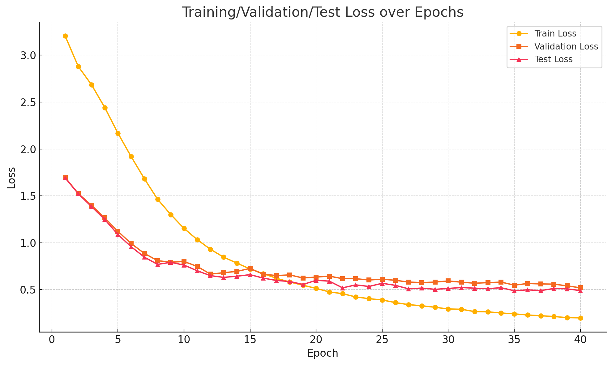
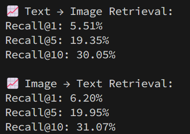
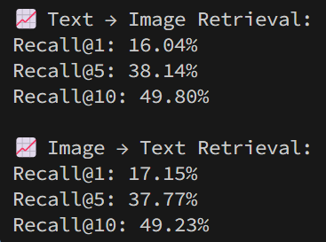
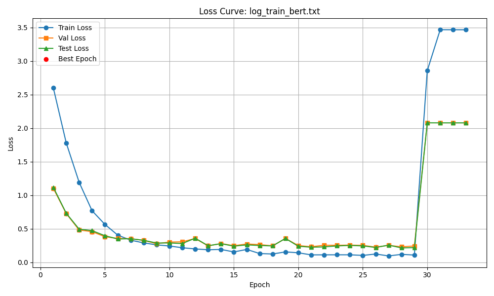
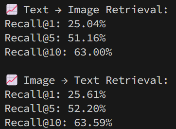
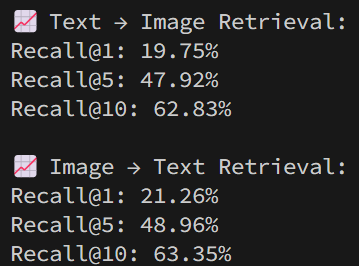

# 《媒体与认知》上机实验最终报告

## 一、基础部分总结

本次作业的中期，我成功实现了一个简化版的 CLIP 模型，通过图像与文本的对比学习，实现多模态语义对齐，并支持文本与图像之间的相互检索。核心思想是将图像和文本分别编码为向量，并通过 InfoNCE 损失函数在训练阶段拉近正样本对之间的距离，推远负样本对的距离，从而使得模型在共享语义空间中能够理解“图”和“文”的对应关系。

具体而言，中期的基本模型采用双塔结构，实现了使用 ResNet18 进行图像特征提取并投影到嵌入空间的图像编码器，以及使用双层 LSTM 网络提取句子语义信息的文本编码器整个系统的输出为图文嵌入对，使用余弦相似度作为匹配依据，通过双向 InfoNCE 损失函数进行训练，完成了图像与文本嵌入空间对齐的基本目标。在实验过程中，我掌握了对比学习的核心思想、双塔结构的建模方式以及 InfoNCE 损失函数的使用方法。

基础模型在 Flickr8k 数据集上进行了训练和评估，主要观测指标包括损失函数下降曲线以及 Recall@K 检索准确率。

下图展示了训练集、验证集和测试集上的损失下降趋势：



可以看出模型在前几轮收敛较快，之后趋于平稳，表明模型能够一定程度上有效学习图文之间的对应关系。

下图展示了 Recall@K 检索准确率，取 K = (1, 5, 10)：



除此之外，实现了文本检索图像（Text → Image）的可视化，展示模型对于指定文本返回的 Top-5 图像如下：


由以上数据可见，模型虽然基本学会了图文嵌入对齐，但在高精度检索方面仍存在较大不足。具体表现为：

- Recall@1 偏低，Text→Image 的 Recall@1 仅为 5.51%，Image→Text 的 Recall@1 也只有 6.20%，说明绝大多数检索未命中正确对应项。这可能是由于：

  - ResNet18 和 LSTM 对复杂语义的建模能力有限；

  - 负样本太“容易”，导致模型没学会在相似图文中做精细判别。

- 在文本 “A man walking in air.” 的图像检索中，Top-1、Top-2 命中了滑板空中动作，基本符合句意，但 Top-3 则是一张男人躺在床板上的图像，与句意几乎不符。这可能是由于：

  - 模型更关注显性词汇的共现（如 “man”），而忽略了句子整体语义组合的正确性；

  - LSTM 编码器难以抓住如“in air”这种抽象空间位置关系。

## 二、关键尝试与改进

### 1. 引入 Transformer 编码器

为提升文本表征质量，首先将原有基于 LSTM 的编码结构替换为 Transformer 模型。

```python
''' TransformerBlock.forward() '''
def forward(self, x: torch.Tensor, mask=None):
    # x: [B, T, D]，D=embed_dim
    B, T, D = x.size()
    # 1. 线性变换得到 q, k, v
    qkv: torch.Tensor = self.qkv_proj(x)  # [B, T, 3*D]
    qkv = qkv.reshape(B, T, 3, self.num_heads, self.head_dim).permute(
        2, 0, 3, 1, 4)  # [3, B, num_heads, T, head_dim]
    q, k, v = qkv[0], qkv[1], qkv[2]  # [B, num_heads, T, head_dim]
    # 2. 计算注意力分数
    attn_scores = torch.matmul(
        q, k.transpose(-2, -1)) / math.sqrt(self.head_dim)  # [B, num_heads, T, T]
    if mask is not None:
        # mask: [B, T] or [B, 1, 1, T]
        if mask.dim() == 2:
            mask = mask.unsqueeze(1).unsqueeze(2)
        attn_scores = attn_scores.masked_fill(mask == 0, float('-inf'))
    attn_weights = F.softmax(attn_scores, dim=-1)
    # [B, num_heads, T, head_dim]
    attn_output = torch.matmul(attn_weights, v)
    # 3. 合并多头
    attn_output = attn_output.permute(0, 2, 1, 3).reshape(B, T, D)
    # 通过输出投影层输出结果
    return self.out_proj(attn_output)

''' TransformerEncoder.forward() '''
def forward(self, captions):
    # captions: [B, T]
    x = self.embedding(captions)
    x = self.pos_encoder(x) # [B, T, D]
    mask = (captions != self.embedding.padding_idx)  # [B, T]
    for layer in self.layers:
        x = layer(x, mask)
    # 池化：对非padding位置取平均
    mask = mask.unsqueeze(-1)  # [B, T, 1]
    x = x * mask
    summed = x.sum(dim=1)  # [B, D]
    counts = mask.sum(dim=1)  # [B, 1]
    pooled = summed / counts.clamp(min=1)
    out = self.fc(pooled)  # [B, D]
    return F.normalize(out, p=2, dim=1)
```

相比于传统序列模型，Transformer 更善于建模全局依赖，能够捕捉句子内部的结构关系。该替换在训练稳定性和验证集表现上均带来明显改善，模型更快收敛，训练结束时在验证集上的 loss 降低到了 0.3088，图文匹配准确率也有所提升：



### 2. 替换为预训练 BERT 模型

在初步尝试 Transformer 架构后，我进一步将文本编码器替换为 BERT（`bert-base-uncased`），同时将初始的 <code>SimpleTokenizer</code> 替换为 BERT 所需的 <code>BertTokenizer</code>，利用其强大的语义理解能力进行特征提取。通过保留 `pooler_output` 作为句向量，显著增强了模型对语义相似句对的区分能力。

与前一版本相比，训练收敛速度显著加快，但由于模型参数量增大，训练过程中出现了梯度爆炸现象，loss 突然异常增大，导致训练只能强行停止。



### 3. 稳定训练过程：裁剪梯度、动态调整 LR 与早停策略

为解决加入 BERT 后的梯度爆炸，引入了梯度裁剪机制（`clip_grad_norm_`），并配合使用基于验证损失的动态学习率调整（`ReduceLROnPlateau`）以及 EarlyStopping 策略进行训练调控。这一组合显著改善了训练过程的稳定性，训练更加可控，匹配准确率显著提升：



### 4. 应用更多训练策略，并使用预训练 ViT 模型

为提高模型对语义扰动的鲁棒性，在图像和文本两个模态上均引入了数据增强策略：图像部分包括颜色扰动、随机灰度和裁剪，文本部分则采用了基于 WordNet 进行同义词替换的方法。

与此同时，为了进一步提高训练性能，对 InfoNCE 损失函数进行了调整：

在优化文本编码器和训练策略后，训练过程中，我注意到 ResNet18 在图像语义建模上的能力已成为瓶颈，导致模型收敛速度较慢。为此，将图像编码器替换为了预训练 ViT（`vit-base-patch16-224`），并冻结全部参数，仅训练输出投影层以适配对比学习目标。



## 三、可视化展示

下图展示了训练集、验证集和测试集上的损失下降趋势：


下图展示了 Recall@K 检索准确率，取 K = (1, 5, 10)：


展示模型对于指定文本返回的 Top-5 图像如下：


## 四、总结与反思

本次实验实现了一个完整的图文对齐对比学习框架，并在基础模型的基础上进行多方面优化，最终显著提升了检索性能与训练稳定性。主要收获包括：

- 掌握了双塔结构在多模态任务中的设计方式；
- 理解了 InfoNCE 损失在图文对比学习中的作用；
- 学会了使用 ViT/BERT 等预训练模型并做合理冻结与 fine-tune；
- 掌握了 EarlyStopping、动态学习率、梯度裁剪等训练优化技巧；
- 理解了数据增强与损失函数调节对模型鲁棒性的影响。

未来可进一步探索：

- 多模态交叉注意力机制；
- 自监督图文对齐数据构造；
- 更复杂的评估指标如 mean rank、median rank 等。