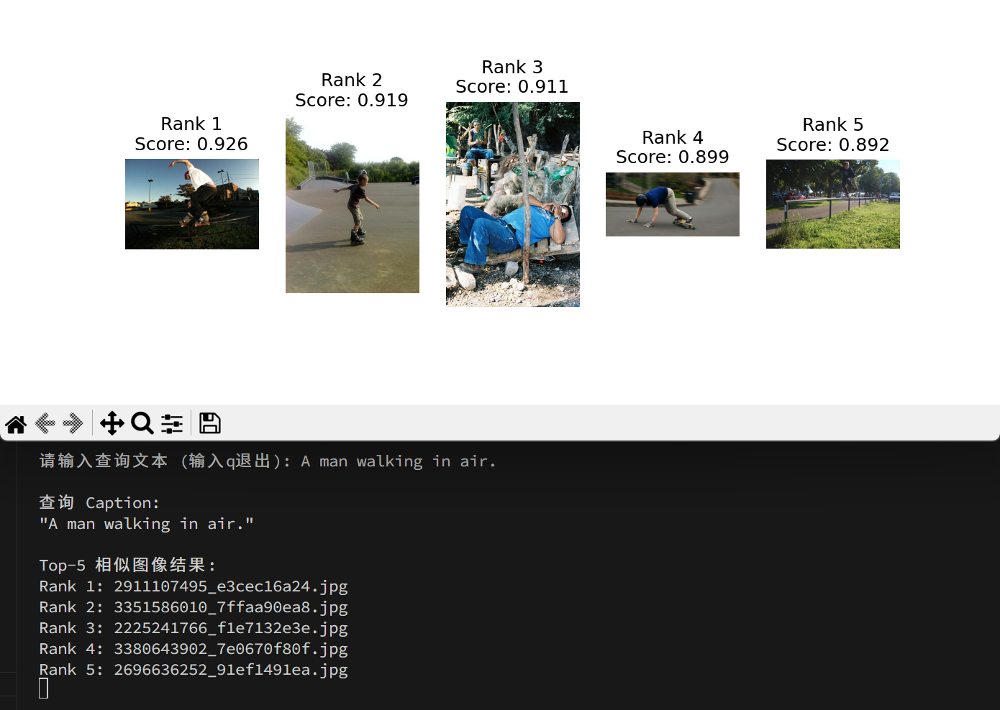
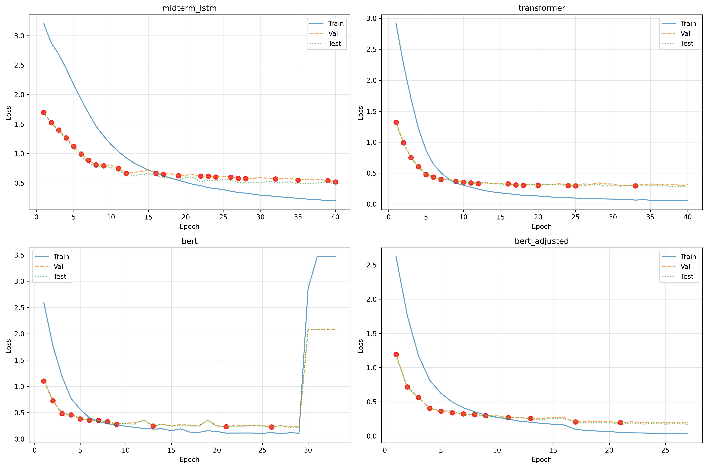
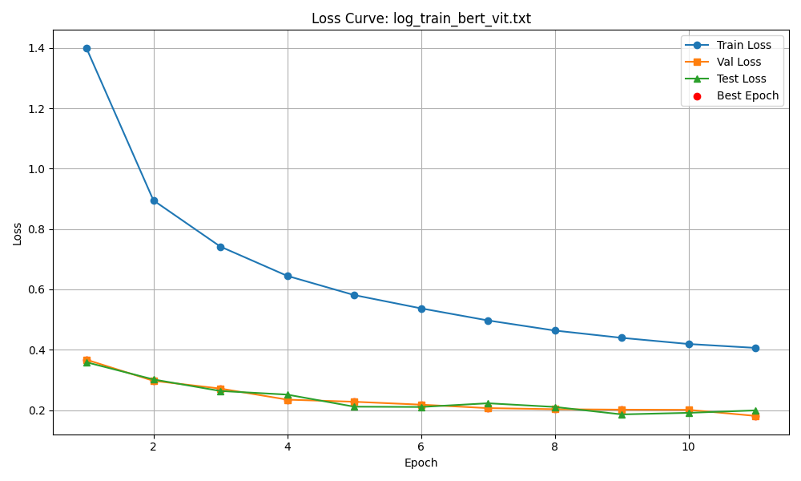
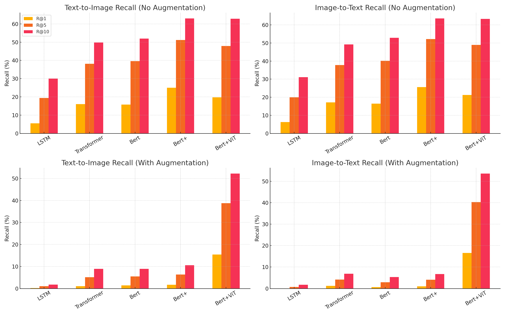
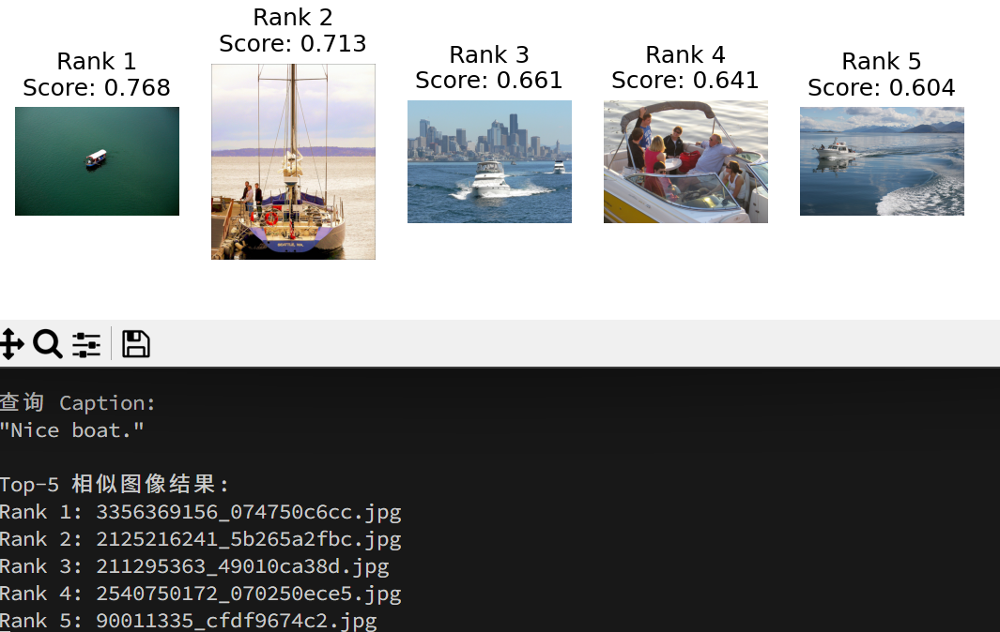
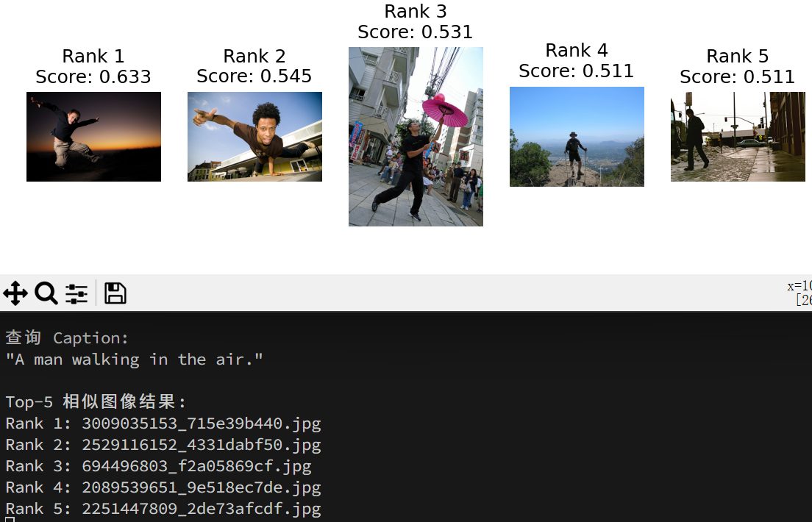
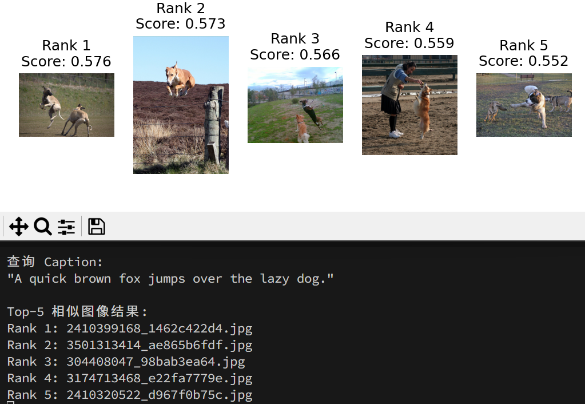
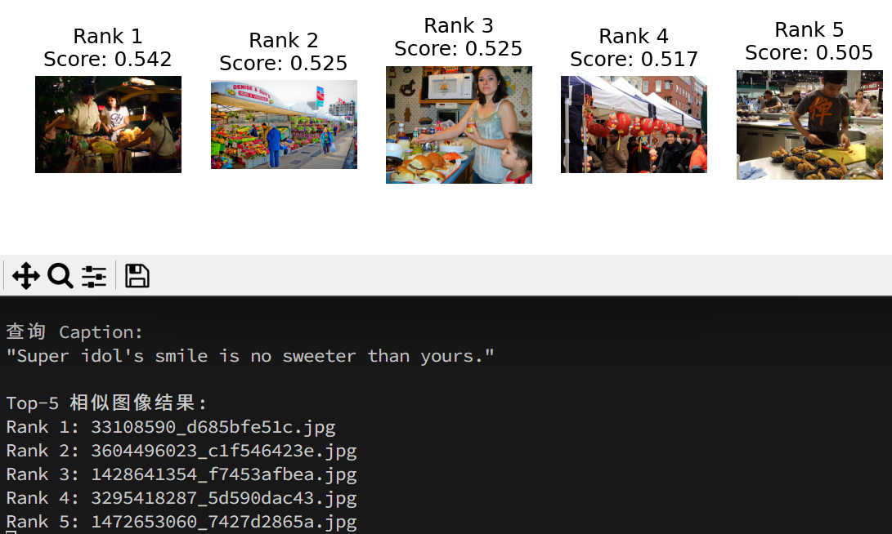

# 《媒体与认知》上机实验最终报告

## 一、基础部分总结

本次作业的中期，我成功实现了一个简化版的 CLIP 模型，通过图像与文本的对比学习，实现多模态语义对齐，并支持文本与图像之间的相互检索。核心思想是将图像和文本分别编码为向量，并通过 InfoNCE 损失函数在训练阶段拉近正样本对之间的距离，推远负样本对的距离，从而使得模型在共享语义空间中能够理解“图”和“文”的对应关系。

具体而言，中期的基本模型采用双塔结构，实现了使用 ResNet18 进行图像特征提取并投影到嵌入空间的图像编码器，以及使用双层 LSTM 网络提取句子语义信息的文本编码器整个系统的输出为图文嵌入对，使用余弦相似度作为匹配依据，通过双向 InfoNCE 损失函数进行训练，完成了图像与文本嵌入空间对齐的基本目标。在实验过程中，我掌握了对比学习的核心思想、双塔结构的建模方式以及 InfoNCE 损失函数的使用方法。

基础模型在 Flickr8k 数据集上进行了训练和评估，主要观测指标包括损失函数下降曲线以及 Recall@K 检索准确率。

下图展示了训练集、验证集和测试集上的损失下降趋势：


可以看出模型在前几轮收敛较快，之后趋于平稳，表明模型能够一定程度上有效学习图文之间的对应关系。

下图展示了 Recall@K 检索准确率，取 K = (1, 5, 10)：


除此之外，实现了文本检索图像（Text → Image）的可视化，展示模型对于指定文本返回的 Top-5 图像如下：



由以上数据可见，模型虽然基本学会了图文嵌入对齐，但在高精度检索方面仍存在较大不足。具体表现为：

- Recall@1 偏低，Text→Image 的 Recall@1 仅为 5.51%，Image→Text 的 Recall@1 也只有 6.20%，说明绝大多数检索未命中正确对应项。这可能是由于：

  - ResNet18 和 LSTM 对复杂语义的建模能力有限；

  - 负样本太“容易”，导致模型没学会在相似图文中做精细判别。

- 在文本 “A man walking in air.” 的图像检索中，Top-1、Top-2 命中了滑板空中动作，基本符合句意，但 Top-3 则是一张男人躺在床板上的图像，与句意几乎不符。这可能是由于：

  - 模型更关注显性词汇的共现（如 “man”），而忽略了句子整体语义组合的正确性；

  - LSTM 编码器难以抓住如“in air”这种抽象空间位置关系。

## 二、关键尝试与改进

### 1. 引入 Transformer 编码器

为提升文本表征质量，首先将原有基于 LSTM 的编码结构替换为 Transformer 模型。

```python
''' TransformerBlock.forward() '''
def forward(self, x: torch.Tensor, mask=None):
    # x: [B, T, D]，D=embed_dim
    B, T, D = x.size()
    qkv: torch.Tensor = self.qkv_proj(x)
    qkv = qkv.reshape(B, T, 3, self.num_heads, self.head_dim)
    	.permute(2, 0, 3, 1, 4)
    q, k, v = qkv[0], qkv[1], qkv[2]
    attn_scores = torch.matmul(
        q, k.transpose(-2, -1)) / math.sqrt(self.head_dim)
    if mask is not None:
        if mask.dim() == 2:
            mask = mask.unsqueeze(1).unsqueeze(2)
        attn_scores = attn_scores.masked_fill(mask == 0, float('-inf'))
    attn_weights = F.softmax(attn_scores, dim=-1)
    attn_output = torch.matmul(attn_weights, v)
    attn_output = attn_output.permute(0, 2, 1, 3).reshape(B, T, D)
    return self.out_proj(attn_output)

''' TransformerEncoder.forward() '''
def forward(self, captions):
    # captions: [B, T]
    x = self.embedding(captions)
    x = self.pos_encoder(x)
    mask = (captions != self.embedding.padding_idx)  # [B, T]
    for layer in self.layers:
        x = layer(x, mask)
    # 池化：对非padding位置取平均
    mask = mask.unsqueeze(-1)
    x = x * mask
    summed = x.sum(dim=1)
    counts = mask.sum(dim=1)
    pooled = summed / counts.clamp(min=1)
    out = self.fc(pooled)
    return F.normalize(out, p=2, dim=1)
```

相比于传统序列模型，Transformer 更善于建模全局依赖，能够捕捉句子内部的结构关系。该替换在训练稳定性和验证集表现上均带来明显改善，模型更快收敛，训练结束时在验证集上的 loss 降低到了 0.3088，图文匹配准确率也有所提升：


### 2. 使用预训练 BERT 模型

在初步尝试 Transformer 架构后，进一步将文本编码器替换为 BERT（`bert-base-uncased`），同时将初始的 <code>SimpleTokenizer</code> 替换为 BERT 所需的 <code>BertTokenizer</code>，利用其强大的语义理解能力进行特征提取。通过保留 `pooler_output` 作为句向量，显著增强了模型对语义相似句对的区分能力。

与前一版本相比，训练收敛速度显著加快，但由于模型参数量增大，训练过程中出现了梯度爆炸现象，loss 突然异常增大，导致训练只能强行停止。


### 3. 训练稳定性优化

为解决加入 BERT 后的梯度爆炸，引入了梯度裁剪机制（`clip_grad_norm_`），并配合使用基于验证损失的动态学习率调整（`ReduceLROnPlateau`）以及 EarlyStopping 策略进行训练调控。这一组合显著改善了训练过程的稳定性，训练更加可控，匹配准确率显著提升：


### 4. 应用更多训练策略，并使用预训练 ViT 模型

为提高模型对语义扰动的鲁棒性，增强模型的泛化能力，在图像和文本两个模态上均引入了数据增强策略：图像部分包括颜色扰动、随机灰度和裁剪，文本部分则采用了基于 WordNet 进行同义词替换的方法。

与此同时，为了进一步提高训练性能，对 InfoNCE 损失函数进行了调整：引入了可学习的温度参数，并尝试增加 margin 以增强对负样本的判别能力，从而进一步优化对比学习目标的表达效果。

```python
# loss.py
class ContrastiveLoss(nn.Module):
    def __init__(self, learnable_temp=True, margin=0.0, initial_temp=0.07):
        super().__init__()
        self.margin = margin
        if learnable_temp:
            self.log_temp = nn.Parameter(torch.tensor(log(initial_temp)))
        else:
            self.register_buffer('log_temp', torch.tensor(log(initial_temp)))

    def forward(self, image_embeds: torch.Tensor, text_embeds: torch.Tensor):
        """
        image_embeds, text_embeds: [batch, embed_dim]
        """
        image_embeds = F.normalize(image_embeds, p=2, dim=1)
        text_embeds = F.normalize(text_embeds, p=2, dim=1)

        temperature = torch.exp(self.log_temp)  # learnable 或固定值
        logits = image_embeds @ text_embeds.T
        logits = (logits - self.margin) / temperature  # margin

        labels = torch.arange(logits.size(0), device=logits.device)

        l_i2t = F.cross_entropy(logits, labels)
        l_t2i = F.cross_entropy(logits.T, labels)

        return 0.5 * (l_i2t + l_t2i)
```

优化文本编码器和训练策略后，在训练过程中，注意到 ResNet18 在图像语义建模上的能力已成为瓶颈，导致模型收敛速度较慢。为此，将图像编码器替换为了预训练 ViT（`vit-base-patch16-224`），并冻结全部参数，仅对输出投影层进行 fine-tune，以适配对比学习目标。由于训练中进行了数据增强，Recall@K 检索准确率并无明显提升，但经测试，文本检索图像的效果得到了显著增强。


## 三、可视化展示

下图展示了各阶段模型在训练集、验证集和测试集上的损失下降趋势：





为了系统评估模型各阶段优化带来的效果，尤其是数据增强策略的影响，分别在无数据增强和有数据增强两种设置下，对多组模型结构的图文检索性能进行了测试。以下的图表展示了在不同设置下的 Recall@K 检索准确率：

##### 无数据增强

|   Recall@ (%)   | 1 (T2I) | 5 (T2I) | 10 (T2I) | 1 (I2T) | 5 (I2T) | 10 (I2T) |
| :-------------: | :-----: | :-----: | :------: | :-----: | :-----: | :------: |
|    **LSTM**     |  5.51   |  19.35  |  30.05   |  6.20   |  19.95  |  31.07   |
| **Transformer** |  16.04  |  38.14  |  49.80   |  17.15  |  37.77  |  49.23   |
|    **Bert**     |  15.79  |  39.64  |  51.98   |  16.41  |  40.19  |  52.87   |
|    **Bert+**    |  25.04  |  51.16  |  63.00   |  25.61  |  52.20  |  63.59   |
|  **Bert+ViT**   |  19.75  |  47.92  |  62.83   |  21.26  |  48.96  |  63.35   |

##### 有数据增强

|   Recall@ (%)   | 1 (T2I) | 5 (T2I) | 10 (T2I) | 1 (I2T) | 5 (I2T) | 10 (I2T) |
| :-------------: | :-----: | :-----: | :------: | :-----: | :-----: | :------: |
|    **LSTM**     |  0.15   |  1.06   |   1.75   |  0.07   |  0.67   |   1.75   |
| **Transformer** |  1.06   |  5.14   |   8.92   |  1.21   |  4.13   |   6.90   |
|    **Bert**     |  1.38   |  5.49   |   8.95   |  0.62   |  2.92   |   5.36   |
|    **Bert+**    |  1.66   |  6.33   |  10.53   |  1.01   |  4.05   |   6.72   |
|  **Bert+ViT**   |  15.45  |  38.75  |  52.22   |  16.56  |  40.31  |  53.56   |



在无数据增强设置下，多数模型都能取得较好的训练表现；而在启用数据增强后，仅有 BERT+ViT 模型仍保持较高的检索准确率，其余模型性能均出现大幅下滑，甚至接近随机水平。这说明数据增强的操作使得模型具备了显著更强的鲁棒性与泛化能力。

最终模型对于指定文本返回的 Top-5 图像如下：

<div style="text-align:center">
	
	<br>
	
</div>

可以观察到，在描述性较强的简洁短语条件下，模型表现尤为稳定，返回图像集中度高、语义一致性强，展示出较强的基础检索准确性；在包含复杂结构或具备多重语义的文本输入下，模型仍能较为准确地提取关键语义元素，检索结果覆盖面广，排名靠前的图像与文本意图匹配度较高，体现出良好的语义建模能力；面对抽象、隐喻性或主观性较强的表达，模型虽难以实现精确匹配，但仍倾向于返回情境相近、风格一致的图像，表明其具备一定的语义泛化与容错能力。

## 四、总结与反思

本次实验围绕图文对齐任务，构建并逐步优化了一个基于对比学习的多模态嵌入模型。起始模型基于 ResNet18 与 LSTM 的双塔结构，采用 InfoNCE 损失完成图文嵌入空间对齐，具备基础的检索能力。

在此基础上，围绕“语义建模能力不足”与“训练不稳定”两类问题，进行了多轮关键尝试与改进，包括模型结构替换（Transformer、BERT、ViT）、训练稳定性优化（梯度裁剪、动态学习率、早停）、损失函数调整以及双模态数据增强策略。最终模型结合 BERT 与冻结的预训练 ViT，显著增强了系统的泛化能力与健壮性。

通过本次上机作业，我在实践中深入领会了以下概念和实践技巧：

- 对比学习框架下图文匹配任务的建模方式；
- 双塔结构在多模态任务中的表达特点；
- InfoNCE 损失函数的实现与调参技巧；
- Transformer/BERT/ViT 等预训练模型在迁移学习中的实际效果；
- 平衡训练效率与模型性能的策略；
- 调控训练稳定性，避免梯度爆炸和过拟合的方法；
- 数据增强对模型泛化能力的影响；

本次作业仍有进一步提升空间，包括但不限于：

- 引入跨模态交互机制（如交叉注意力）替代双塔结构，以提升细粒度匹配能力；
- 结合更高质量的预训练嵌入或图文对齐模型；
- 引入更复杂的评估指标，如 median rank、mean reciprocal rank 等，以更全面评估模型表现；